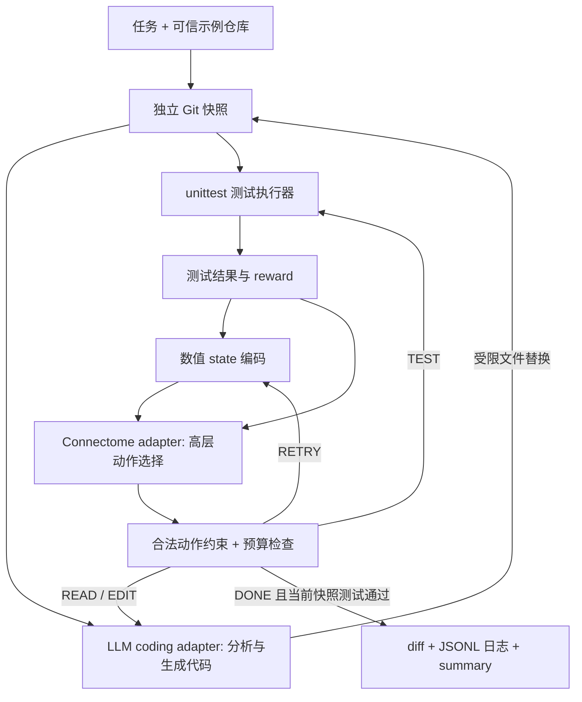

# 架构与接入约定

## 责任边界



后端是同步 Python worker，CLI 是入口。没有 Web UI、任务队列或远程执行 API；后续可在 Controller 外加调度层，每个任务仍需独立工作区和实例。

| 模块 | 职责 |
| --- | --- |
| `state.py` | 五个动作、状态、归一化编码、奖励函数 |
| `connectome.py` | 抽象策略接口、mock、可注入 neural bridge |
| `llm.py` | 语言/编程执行接口、脚本 mock、OpenAI 实现 |
| `sandbox.py` | 小型输入目录快照、独立 Git、文件允许列表、diff、指纹 |
| `testing.py` | 固定 unittest 命令、超时、进程组清理、输出上限 |
| `controller.py` | 有界循环、动作校验、结果有效性、日志与产物 |
| `__main__.py` | 参数和环境配置、实例装配、退出码 |

## 动作及生命周期

| 动作 | 前置条件 | 效果 |
| --- | --- | --- |
| READ | 初始或等待下一次 EDIT | LLM 阅读快照并返回分析 |
| EDIT | 已 READ，仍有尝试预算 | LLM 给出允许文件的完整替换文本；使旧测试结果失效 |
| TEST | 候选修改后 | 运行真实测试，记录退出码、超时、数量和输出 |
| RETRY | 当前测试失败且有尝试预算 | 保留候选代码和失败日志，清除测试有效状态，进入下一次 EDIT |
| DONE | 当前快照具有有效的通过结果 | 再校验文件指纹，输出补丁；不自动提交或推送 |

baseline 测试属于前置验证，不引入第六个动作。`exhausted`、`error` 是运行状态，也不是动作。初始 bug 已修好的任务仍会按原型流程尝试 EDIT，当前原型不优化无须修改的任务。

允许动作由 Controller 给出，策略只能在其中选择；非法动作直接拒绝。当前允许动作约束很强，大多数状态只有一个合法动作，因此 mock 主要用于闭环验证，尚不能衡量真实连接组的策略能力。v0.2 的真实后端默认使用更宽动作约束（见下文）。后续研究若放宽约束，应保留 DONE 的测试门槛和资源预算，并用相同约束下的规则/随机/LLM 策略作为对照。

## 状态编码与奖励

`State.encode()` 返回 `schema=flycoder.state.v1` 和具名浮点特征：

- 布尔特征：read、edited、tested、passed、timed_out，编码为 0/1。
- step_fraction、attempt_fraction：消耗预算比例，截断到 1。
- change_fraction：变更文件数 / 10，截断到 1。
- reward：上一动作奖励；last_READ 等五个特征是上个动作的 one-hot。

动作选择前传入 observation，动作完成后调用 `feedback(reward, next_observation)`。策略不收到任务文本、代码或 traceback；这些只传给 coding adapter。奖励是人为定义的工程信号：READ/EDIT = -0.01，TEST 通过 = +1，失败 = -0.3，超时 = -0.5，RETRY = -0.1，DONE = 0。mock 仅记录反馈，不会学习；奖励值不能解读为生物奖励机制。

## 连接组适配器

`ConnectomeAdapter` 提供 `reset(seed)`、`select(observation, allowed)`、`feedback(...)`、`close()`。

`NeuralConnectome` 接收一个 `NeuralBackend` 实例。这是本项目自己的桥接约定，**不是 MaleCNS 或 DOOMFLY 已经提供的公共接口**：

1. `reset(seed)` 加载或重置动态状态。
2. `stimulate_and_step(features)` 将具名状态映射为刺激，推进固定时间窗，返回五动作分数。
3. `reward(value)` 接收工程奖励，如何转换为神经调制或学习信号由实现说明。
4. `close()` 释放数据及运行时资源。

`NeuralConnectome` 对合法动作的有限数值分数取最大值，分数无效即报错；同分按合法动作列表顺序决定。它自身不模拟神经元。示意装配方式：

```python
policy = NeuralConnectome(YourImplementedNeuralBackend(...))
controller = Controller(sandbox, policy, coder, runner, task, run_dir)
controller.run()
```

接入 MaleCNS/DOOMFLY/FlyWire 时还需实际完成：数据版本与校验和记录、许可确认、神经元 ID 映射、边权/递质转换、动态模型、刺激输入群体、输出群体与动作解码、随机种子、资源测量，以及真实后端的契约测试。MaleCNS 与 FlyWire 分别处理，不能假设它们的 ID 或结构可互换。v0.2 已实现 MaleCNS 数据加载与原生内核适配；FlyWire 保持未实现。未移植游戏接口，实际计数以本机数据审计结果为准。

## LLM 与文件修改

`CodingAdapter.read(task, files)` 返回分析文本；`edit(...)` 返回 `{相对路径: 完整内容}`。OpenAI adapter 通过 Responses API 请求 JSON；检查响应完成状态和结构，再由 sandbox 验证所有文件路径及大小后写入。模型没有 shell 调用接口，也不能控制测试命令。RETRY 会把上一轮测试日志与当前候选代码提供给下一次 EDIT。

JSONL 保留测试输出，不保存 API 密钥或原始 HTTP 请求。日志与补丁仍可能包含项目内容，不应默认公开。

## 执行边界与已知限制

每次运行建立新的独立 Git 仓库，不共用原仓库工作树、历史、hooks 或配置。读取上下文限制为快照的已跟踪文本，fingerprint 覆盖所有已跟踪文件。测试前后指纹需一致，DONE 时再次匹配；该机制检测常规文件变化，不能抵抗恶意测试伪造结果。

测试运行命令固定为当前 Python 的 `-m unittest discover -s tests -v`，不使用 shell。输出仅保留末尾 32 KiB，超时终止进程组。采用 unittest 汇总文本检测测试数量，非标准 runner 需实现新的结构化结果接口。

Git 快照不是 OS 沙箱，测试是可信代码。容器中 API 调用与测试仍属于同一任务容器，尚不适合多租户。当前版本未实现事务级文件恢复、断点续跑、并发调度、真实神经学习或实际服务器发布。


## 自定义 Chat Completions 接口

新增 `ChatCompletionsCodingAdapter`，复用 coding adapter 的 READ/EDIT 输入约定，通过 `messages` 发送任务和上下文，通过 `choices[0].message.content` 读取 JSON。只接受 `finish_reason=stop` 的完整响应。DeepSeek 使用该实现和默认基址；通用模式允许配置模型、基址、密钥、超时、输出上限与 JSON 模式。底层仅使用标准库，不新增 Python 依赖。

DeepSeek 协议依据：[JSON Output 官方文档](https://api-docs.deepseek.com/guides/json_mode/)。既有 OpenAI Responses adapter 保留独立请求实现。通用接口的密钥不会回退到 OPENAI_API_KEY；拒绝 HTTP 重定向，错误记录不包含供应商原始响应体。控制器仍只选择高层动作，修改文件前继续执行原有允许列表检查。


## v0.2 已实现后端（取代上文的 MaleCNS 接入待办）

`malecns.py` 实现 `MaleCNSBackend`，调用固定版本 DOOMFLY 的 `NativeBrain`。完整保留导入后的节点与边；不改变完整图的权重。每次动作推进 100 ms 模拟时间，等待 LLM 时暂停模拟，每个任务开始时重置状态。

14 项数值特征按固定顺序映射为视网膜横向亮度条带，reward 从 [-1,1] 映射到 [0,1]。这是人工视觉编码，不是代码理解。500 个读出神经元来自对四种合成刺激响应变化最大的下游群体（排除直接刺激的视网膜、lamina、sugar 群体），按固定随机种子分成五组，每组平均放电率对应一个动作。没有按编程任务结果调参，映射不具天然生物动作语义。reward 只记录并作为数值输入，不改变突触权重。

真实后端及随机基线启用相同宽动作约束；mock 可通过 `--explore-actions` 使用同样约束。读完代码后允许 EDIT，候选修改后允许 READ/EDIT/TEST；测试失败后允许 READ/RETRY；连续重复 READ 受限，EDIT 有预算。DONE 仍只在当前文件指纹对应通过测试时合法。单一合法动作由约束决定，不应称为自由神经选择。存在多个合法动作时按神经分数选择；最高分并列、读出沉默或校验失败时拒绝运行，不回退到 mock。

显式对照 `--neural-control no-stimulus/disconnected/shuffled-readout` 在日志中标记；默认 `intact` 不执行这些干预。对照实验记录与使用限制见 neural-local.md。
